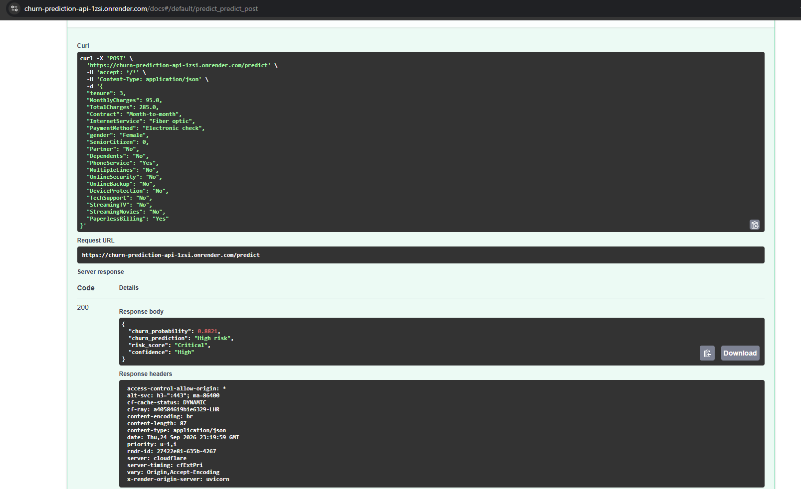
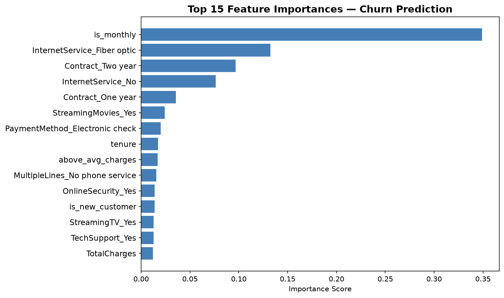

# Churn Prediction API

> XGBoost classifier predicting customer churn probability, 
> served as a live REST API via FastAPI and deployed on Render.

**Live API:** https://churn-prediction-api.onrender.com/docs

---

## Demo



Send a POST request to /predict with a customer profile:

```bash
curl -X POST "https://churn-prediction-api.onrender.com/predict" \
  -H "Content-Type: application/json" \
  -d '{"tenure": 3, "MonthlyCharges": 95.0, "Contract": "Month-to-month", ...}'
```

Response:
```json
{
  "churn_probability": 0.88,
  "churn_prediction": "High risk",
  "risk_score": "Critical",
  "confidence": "High"
}
```
## Model performance




| Model | ROC-AUC |
|---|---|
| XGBoost (selected) | ~0.845 |
| Random Forest | ~0.830 |
| Logistic Regression | ~0.845 |

---

## Architecture

```
IBM Telco dataset (7,043 customers)
        │
        ▼
scripts/prepare_data.py
(cleaning, feature engineering, one-hot encoding)
        │
        ▼
scripts/train_model.py
(Logistic Regression → Random Forest → XGBoost)
(cross-validation, ROC-AUC evaluation)
        │
        ▼
models/churn_model.pkl   (saved XGBoost model)
        │
        ▼
api/main.py  (FastAPI endpoint)
        │
        ▼
Render (live deployment)
https://churn-prediction-api.onrender.com
```

---

## Skills demonstrated

| Skill | How |
|---|---|
| Machine learning | XGBoost, cross-validation, ROC-AUC evaluation |
| Feature engineering | 5 engineered features, one-hot encoding, scaling |
| Model evaluation | 3 models compared, confusion matrix, classification report |
| Python — FastAPI | REST endpoint with Pydantic schema validation |
| Deployment | Live API on Render, auto-redeploys on git push |
| Documentation | Model card with limitations and ethical considerations |

---

## Quick start (local)

```bash
git clone https://github.com/ollie48654/churn-prediction-api
cd churn-prediction-api
python -m venv venv && venv\Scripts\activate
pip install -r requirements.txt
python scripts/prepare_data.py
python scripts/train_model.py
uvicorn api.main:app --reload
```

Open http://127.0.0.1:8000/docs

---

## Model card

See [docs/model_card.md](docs/model_card.md) for full details on 
performance, limitations, and ethical considerations.

## Dataset

IBM Telco Customer Churn — 7,043 customers, 20 features, 26.5% churn rate.
[Available on Kaggle](https://www.kaggle.com/datasets/blastchar/telco-customer-churn)